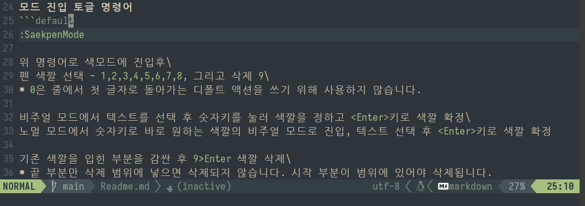

# SaekPen 색펜
[한글](Readme_kr.md) \ [English](Readme.md)

※ Saek is the Korean word for color.

Colored pencil or highlighter to use in Neovim

- When highlighting a document
- Presenting with Neovim
- Live coding presentations
- When spies hide secret messages?!


```default
saekpen
├── LICENSE
├── lua
│   └── saekpen
│       ├── history.lua
│       ├── init.lua
│       └── lib
│           └── stack.lua
├── plugin
│   └── saekpen.vim
├── Readme.md
└── saekpen.gif

5 directories, 7 files
```
### Install
Use the Lazy Plugin Manager.

Using default settings.
```lua
{
  'lionhairdino/saekpen.nvim',
  config = true,
  cmd = 'SaekpenMode'
},
```
Using custom settings.
```lua
  {
    'lionhairdino/saekpen.nvim',
    config = function()
      require "saekpen".setup({
        color_table = {
          { fg = '#FFFFFF', bg = '#cf494c', ctermfg = 15, ctermbg = 0 },
          { fg = '#000000', bg = '#60b442', ctermfg = 15, ctermbg = 4 },
          { fg = '#000000', bg = '#db9c11', ctermfg = 0,  ctermbg = 10 },
          { fg = '#000000', bg = '#fce94f', ctermfg = 0,  ctermbg = 14 },
          { fg = '#FFFFFF', bg = '#0575d8', ctermfg = 0,  ctermbg = 9 },
          { fg = '#000000', bg = '#ad5ed2', ctermfg = 0,  ctermbg = 5 },
          { fg = '#000000', bg = '#1db6bb', ctermfg = 0,  ctermbg = 11 },
          { fg = '#000000', bg = '#bab7b6', ctermfg = 0,  ctermbg = 15 },
        }
      })
    end,
    cmd = 'SaekpenMode'
  },
```
[norcalli/nvim-colorizer.lua](https://github.com/norcalli/nvim-colorizer.lua) plugins can help with coloring.

### Editing
Toggle commands to enter saek(colored)pen mode.
```default
:SaekpenMode
```
After entering the color mode with the above command, execute the following commands\
Select pen color - `1`, `2`, `3`, `4`, `5`, `6`, `7`, `8`, and delete `9`

Note that `0` is not used to write the default action, which is to return to the first character on the line.

#### Set the selected area color
- In visual mode, select text, press the number keys to set the color, and confirm the color with `<Enter>`.
- In normal mode, press the number keys to enter the visual mode of the desired color, select the text, and press `<Enter>` to confirm the color.

#### Remove color
Wrap around the existing coloring and type `9` > `Enter`\
If you put only the end in the deletion range, it will not be deleted. The beginning must be in the range to be deleted.

`U` Undo. `R` Redo.

***Warning! If you close the buffer, the edited color will disappear***.

#### Initialization that can't be undone
```default
:SaekpenClear
```

### Save and Load
#### Save
At least within the **last 5 lines** of your document, do the following
```deaulr
:SaekpenOutput
```
The above command outputs saekpen data in the form `/Saekpen;...` at the current cursor position.\
Make appropriate comments that do not affect the current file contents. ex) `-- /Saekpen;...`

#### Load
```deault
:SaekpenInput
```
Find the saekpen data within the last **5 lines** and reflect it in the document.

#### Convert to ANSI Escape Code for Discord and copy to clipboard 
When you're done editing the Saekpen, select the area you want to copy in visual mode and press the `Y`(Capital) key to copy it to the clipboard. You can then paste it in the Discord app.\
Note - Discord provides ANSI backgrounds with slightly different colors than the standard ones, so it won't convert to a perfect match.

### Todo
[-] Save saekpen data to a file\

### Known Bug
With LSP server attached, things that are colored on multi-line are uncolored when the cursor hovers over them.

### Vim.kr
I'm new to Lua, and I'm developing a Neovim plugin for the first time, so I'm a bit clumsy. I've been getting answers to most of my stumbling blocks from people on Vim.kr. If you're interested in Vim and Neovim, you can visit the [Vim.kr](http://vim.kr/) and [Vim.kr (Korean Vim User Group)](https://discord.gg/TwaYqgtQYf) discord servers.

