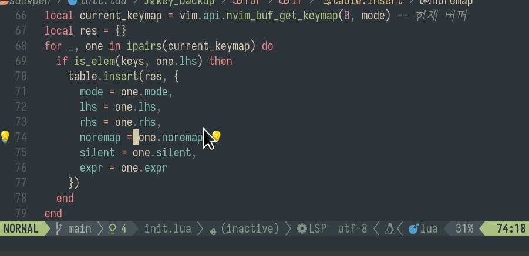

# 색펜 SaekPen
※ Saek is the Korean word for color.

네오빔에서 쓸 색연필


```default
saekpen
├── LICENSE
├── lua
│   └── saekpen
│       ├── deps
│       └── init.lua
├── plugin
│   └── saekpen.vim
└── Readme.md

5 directories, 4 files
```

### 사용법
**모드 진입 토글 명령어**
```default
:SaekMode
```
위 명령어로 색모드에 진입후\
펜 색깔 선택 - `1`,`2`,`3`,`4`,`5`,`6`,`7`,`8`, 그리고 삭제 `9`\
※ `0`은 줄에서 첫 글자로 돌아가는 디폴트 액션을 쓰기 위해 사용하지 않습니다.

비주얼 모드에서 텍스트를 선택 후 숫자키를 눌러 색깔을 정하고 `<Enter>`키로 색깔 확정\
노멀 모드에서 숫자키로 바로 원하는 색깔의 비주얼 모드로 진입, 텍스트 선택 후 `<Enter>`키로 색깔 확정\
기존 색깔을 입힌 부분을 감싼 후 `9`>`Enter` 색깔 삭제\
※ 끝 부분만 삭제 범위에 넣으면 삭제되지 않습니다. 시작 부분이 범위에 있어야 삭제됩니다.

**버퍼를 닫으면, 편집한 색깔은 사라집니다**

**초기화 명령어**
```default
:SaekClear
```
### 기본 설정
```default
color_table = {
  { fg = '#FFFFFF', bg = '#cf494c', ctermfg = 15, ctermbg = 0 },
  { fg = '#000000', bg = '#60b442', ctermfg = 15, ctermbg = 4 },
  { fg = '#000000', bg = '#db9c11', ctermfg = 0,  ctermbg = 10 },
  { fg = '#000000', bg = '#fce94f', ctermfg = 0,  ctermbg = 14 },
  { fg = '#FFFFFF', bg = '#0575d8', ctermfg = 0,  ctermbg = 9 },
  { fg = '#000000', bg = '#ad5ed2', ctermfg = 0,  ctermbg = 5 },
  { fg = '#000000', bg = '#1db6bb', ctermfg = 0,  ctermbg = 11 },
  { fg = '#000000', bg = '#bab7b6', ctermfg = 0,  ctermbg = 15 },
}
```

### todo
- 사용자가 변경 가능한 설정 드러내기
- 색 편집 결과 저장
- ANSI Escape Code로 뽑아내어 클립보드에 저장 (디스코드에 붙이는 용도)
- 색깔 인디케이터

### 알려진 버그
LSP서버가 붙은 상태에서, 멀티 라인에 색을 입힌 것들은, 커서가 올라가면 색이 해제됩니다.
 
### Vim.kr
Lua를 처음 만지며, 처음으로 네오빔 플러그인을 개발하고 있어 어설픈 게 많습니다. 개발 중 막히는 것들은 대부분 Vim.kr에 계신 분들께 답을 얻고 있습니다. 빔, 네오빔에 관심 있는 분은 [Vim.kr](http://vim.kr/)을 방문해 보세요

